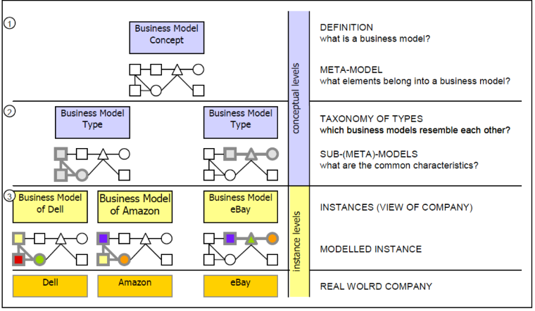
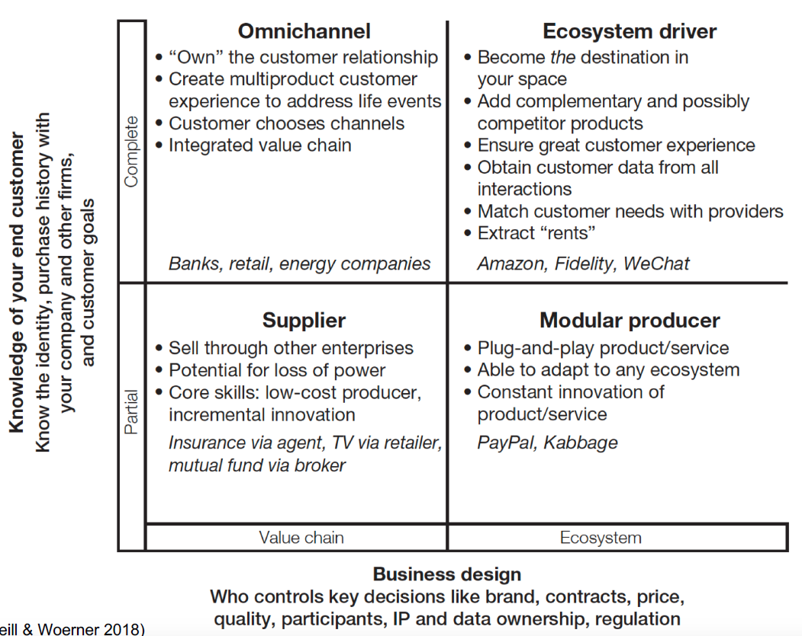
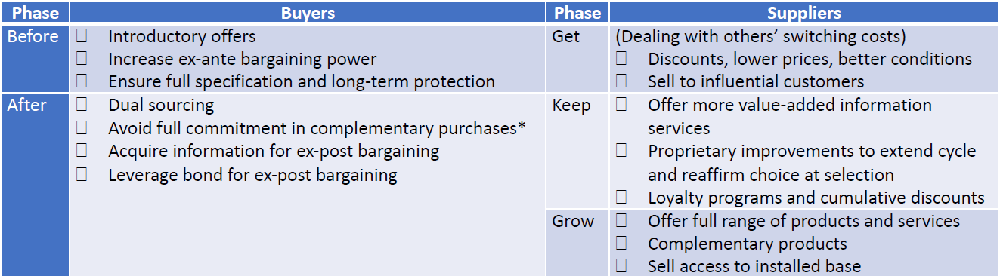
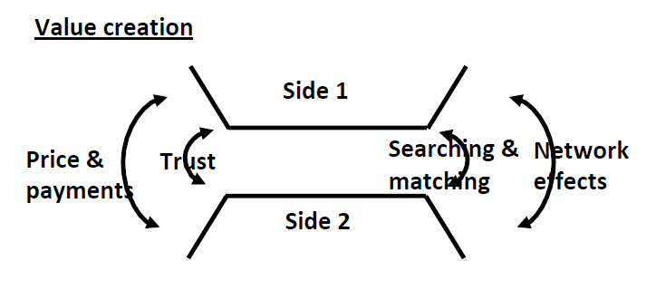
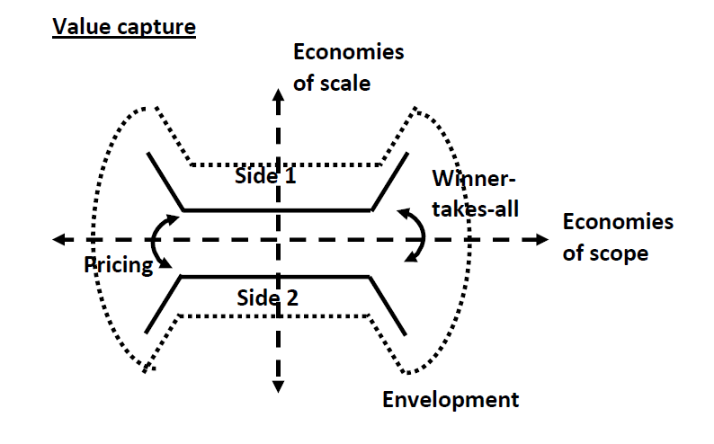
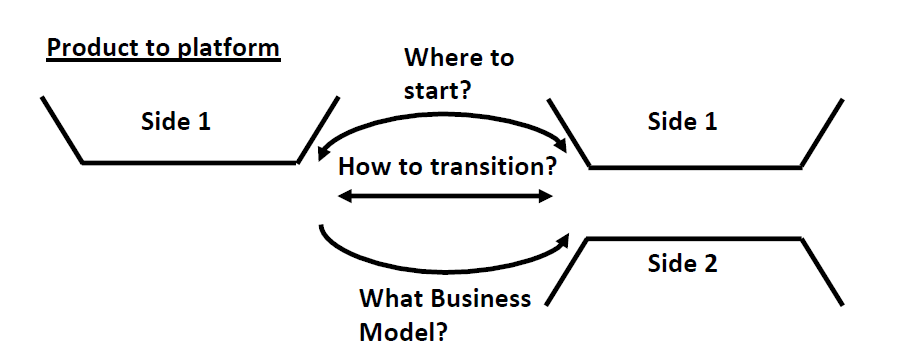
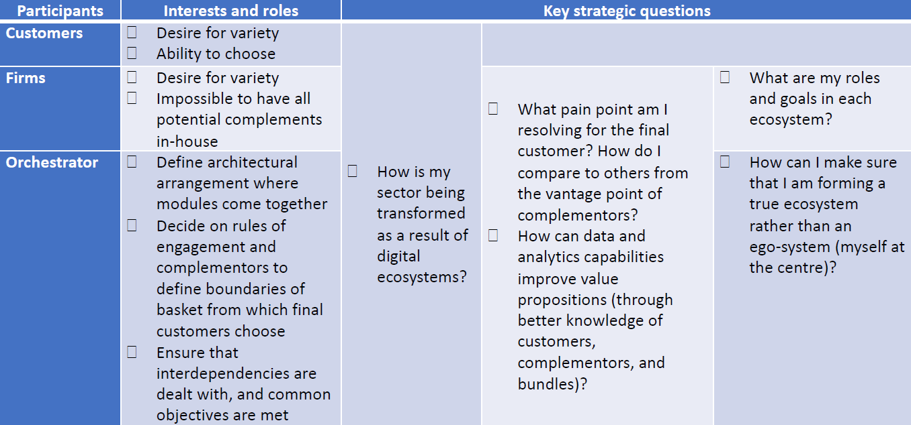

<h1> Notes for the exam - 15th of January 2024

<h2> Table of Contents </h2>

- [Chapter 1: Digital Business Models](#chapter-1-digital-business-models)
  - [Business Model](#business-model)
  - [Definition](#definition)
  - [Building Blocks - The Business Model Canvas](#building-blocks---the-business-model-canvas)
  - [Digital Business Models](#digital-business-models)
  - [The DBM Framework](#the-dbm-framework)
  - [Types of Digital Business Models](#types-of-digital-business-models)
- [Chapter 2: Key Features of the Digital Economy](#chapter-2-key-features-of-the-digital-economy)
  - [Information Goods](#information-goods)
    - [Differential Pricing](#differential-pricing)
    - [Rights Management](#rights-management)
    - [Attention Economics](#attention-economics)
    - [Experience Good](#experience-good)
    - [Example: Spotify](#example-spotify)
  - [Information Technology](#information-technology)
    - [Switching Costs and Lock-In](#switching-costs-and-lock-in)
    - [Example: MS Windows](#example-ms-windows)
    - [Network Effects](#network-effects)
    - [Example: Waze](#example-waze)
  - [Change](#change)
- [Chapter 3: Platform Strategies](#chapter-3-platform-strategies)
  - [Value Creation](#value-creation)
  - [Value Capture](#value-capture)
  - [Product to Platform](#product-to-platform)
  - [Example: Amazon -\> Amazon Marketplace](#example-amazon---amazon-marketplace)
    - [Value Creation](#value-creation-1)
    - [Value Capture](#value-capture-1)
    - [Transition](#transition)
- [Chapter 4: Ecosystem Dynamics](#chapter-4-ecosystem-dynamics)
  - [Enablers](#enablers)
  - [How to Organise Economic Activity](#how-to-organise-economic-activity)
  - [Complementor Relations](#complementor-relations)
  - [Key Strategic Questions](#key-strategic-questions)
- [Chapter 5: AI-Based Business Models](#chapter-5-ai-based-business-models)
- [Chapter 6: Data-Driven Business Models](#chapter-6-data-driven-business-models)
- [Chapter 7: Software as a Service and Servitization Business Models](#chapter-7-software-as-a-service-and-servitization-business-models)
- [Chapter 8: Omnichannel Business Models](#chapter-8-omnichannel-business-models)

## Chapter 1: Digital Business Models

### Business Model

- Described as the blueprint of how a company does business, translating strategic positioning and goals into a business functioning model​​.
- Describes the rationale of how an organization creates, delivers, and captures value

- **Business model concept hierarchy**:

  

- **Business Models vs. Business Process Modeling**: while a business model is usually a view of the firm's logic for creating and commercializing value, a business process model is more about how a business case is implemented in processes.

- **Business Model vs. Business Strategy**: a business model is the blueprint of how a company does business, translating strategic positioning and goals into a conceptual model. A strategy is an integrated plan of objectives, policies and actions. Its the pursue of a fit between the internal capabilities and the external environment. Its the development of a sustainable competitive advantage.
  - The business model as a system shows how **the pieces of a business concept fit together, while stategy also includes competition and implementation**.

### Definition

- A business model is a conceptual tool comprising elements and relationships, expressing a firm's business logic.
- It includes the architecture of the firm and its network of partners for creating, marketing, and delivering value​​.

### Building Blocks - The Business Model Canvas

<table style="width:100%">
  <tr>
    <th>Pillar</th>
    <th>Business Model Building Block</th>
    <th>Description</th>
  </tr>
  <tr>
    <td>Product</td>
    <td>Value Proposition</td>
    <td>
      <ul>
        <li> Overall view of a company's bundle of products and services
        <li> The reason why customers turn to one company over another
      </ul>
    </td>
  </tr>
  <tr>
    <td rowspan="3">Customer Interface</td>
    <td>Target Customer</td>
    <td>
      <ul>
        <li>Customer segment(s) the company wants to offer value to
        <li>Heart of any business model
        <li>In order to better satisfy customers, a company may group them into distinct segments with common needs, common behaviors, or other attributes
      </ul>
    </td>
  </tr>
  <tr>
    <td>Distribution Channel</td>
    <td>
      <ul>
        <li> Various means of the company to get in touch with its customers
        <li> Touch points that play an important role in the customer experience
      </ul>
    </td>
  </tr>
  <tr>
    <td>Relationship</td>
    <td>
      <ul>
        <li> Kind of links a company establishes between itself and its different customer segments
        <li> The customer relationships called for by a business model deeply influence the overall customer experience
      </ul>
    </td>
  </tr>
  <tr>
    <td rowspan="3">Infrastructure Management</td>
    <td>Key Resources</td>
    <td>
      <ul>
        <li> Most important assets required to make a business model work
        <li> Physical, financial, intellectual, or human
      </ul>
  </tr>
  <tr>
    <td>Key Activities</td>
    <td>
      <ul>
        <li> Most important things a company must do to make its business model work
        <li> Production, problem solving, platform/network
      </ul>
  </tr>
  <tr>
    <td>Partner Network/Key Partnerships</td>
    <td>
      <ul>
        <li>Network of cooperative agreements with other companies necessary to effiently offer and commercialize value
        <li> 4 types of partnerships:
          <ul>
            <li> Strategic alliances between non-competitors
            <li> Coopetition between competitors
            <li> Joint ventures to develop new businesses
            <li> Buyer-supplier relationships to assure reliable supplies
          </ul>
      </ul>
    </td>
  </tr>
  <tr>
    <td rowspan="2">Financial Aspects</td>
    <td>Revenue Model</td>
    <td>
      <ul>
        <li> How a company makes money through a variety of revenue streams
        <li> Two types of revenue models: transactional revenue from one-time customer payments and recurring revenue from ongoing payments.
      </ul>
    </td>
  </tr>
  <tr>
    <td>Cost Structure</td>
    <td>
      <ul>
        <li> Monetary consequences of the means employed to execute a company's business model
    </td>
</table>

### Digital Business Models

- Emphasizes that digital transformation is about change, not just technology.
- Three types of digital transformation:
  - **New Entrants**: different business model and superior digital capabilities - enter an existing market offering a new value proposition.
    - Example: Uber, Airbnb.
  - **New business model for traditional players**: existings companies adopt a business model that is more appealing to their customers.
    - Example: Nordstorm transition to an omnichannel business model.
  - **Crossing industry boundaries**: companies that are successful in one industry use digital tactics to enter another industry or domain.
    - Example: Apple entering the music industry with iTunes.

- **Creating the Next Generation Enterprise**: Every other enterprise can use digital technologies to create, thus they don't necessarily offer a competitive advantage; The key is to differentiate the business by offering something new and compelling through digital vehicles.

- **Two Dimensions of Digital Business Models**:
  - Moving from controlled value chains to complex networked systems.
  - Transitioning from less familiarity with customer needs to better understanding and engagement​​.

### The DBM Framework

  

### Types of Digital Business Models

1. Suppliers: Partial knowledge of end customers, operating in the value chain of another enterprise.
   - As digitization progresses, suppliers are likely to lose power and be pressured to reduce prices.
   - Move up in the DBM framework by learning more and connecting with end customers.
   - Example: P&G.
2. Omnichannels: Provide access to products across multiple channels, focusing on understanding the end customer.
   - Move up in the DBM, acting on increased knowledge of end customers and their life events, and reducing customer churn.
   - Companies use big data and analytics, social media, sentiment analysis, and other tools as avenus for increasing their understanding of customers.
   - Example: Citibank.
3. Modular Producers: Offer plug-and-play products or services adaptable to various ecosystems.
   - To thrive, they need to constantly innovate their products & services ensuring that they are among the best options in the market.
   - They operate in a hypercompetitive environment, as it's usually easy for customers to switch to another provider, and the whole point of being a modular producer is being plug-and-play.
   - Example: Paypal.
4. Ecosystem Drivers: Establish a digital ecosystem, offering a range of services to meet customer needs.
   - Use their brand strength to attract participants, ensure a great customer experience, and offer a one-stop shopping.
   - Like omnichannels, they also inspire to "own" the customer relationship but more importantly, they want to become the destitation for a subset of their customers.
   - Example: Apple, Google​​.

**Moving Up & Right in the DBM Framework**:

- Digitization is the vehicle for moving up and right in the DBM framework:
  - Create a strong connection with end customers (move up), and
  - with other companies and suppliers that they partner with (move right), to meet more of the customers' needs.

## Chapter 2: Key Features of the Digital Economy

### Information Goods

- **Information Good**: Anything that can be digitized.

| Stage | Characteristics | Implications |
| --- | --- | --- |
| **Production** | - High fixed, near zero marginal costs.   - Unlimited capacity | Pricing on **value**
| **Distribution** | - Cheaply copied and distributed.   - Enforcement of rights is challenging. | Manage rights for **value**, not protection.
| **Search** | - Fast, ubiquitous, and cheap to access | Attention: find what is of **value**, avoid the rest.
| **Fruition** | - Experience good | Experience to **value**.

#### Differential Pricing

- **Differential Pricing**: How to price on value?
  - **Group Pricing**: pricing as a function of observables; student, zip code, assets
  - **Versioning**: people self-select
  - **Personalization**: perfect discrimination; theoretical ideal

| Category | Example | Why (can they) do it? |
| --- | --- | --- |
| **Personalized** | Elsevier and Universities | - Know the demand curve   - Large B2B contracts – easier to charge different prices to different customers
| **Grouping** | Spotify - countries, families, students | - Customer characteristics are observable and correlated with demand behaviour   - Characteristics are unchangeable   - No resale
| **Versioning** | Netflix - basic, standard, premium | - Customers with different willingness-to-pay value features differently

#### Rights Management

- **Rights Management**: How much free use maximizes value?

| Example of goods | Example of strategies to maximize value | Categories of strategies to maximize value |
| --- | --- | --- |
| News Media | Freely share a certain number of articles | Give away part, sell the rest |
| Magazines | Limited free views per month | Limit demand for repeated views |
| Anti-Virus | Free version with limited features | Give away similar, but not identical, products |
| Books, magazines | Easy to browse, hard to print online versions | Give away similar, but not identical, products |
| Elsevier (outside subscription) | Free browse and search, charge for content | Sell complementary goods |
| McAfee 1989 | Free with full functionality | Pay whathever the user thinks it is worth |

#### Attention Economics

- **Attention Economics**: How to facilitate getting to the most valuable goods?

| Example of goods | Example of strategies | Categories of strategies |
| --- | --- | --- |
| Digital Media Purchases | - Reccomenender systems - may not be customized. e.g., top sellers   - Personalized contents | Recommenders and personalisation – based on profile, historical and similar profiles

#### Experience Good

**Experience Good**: How to facilitate evaluation of goods?

| Example of goods | Example of strategies | Categories of strategies |
| --- | --- | --- |
| Musicians' new albums | Free song | **Preview and browse** - access to parts, for a limited time. for free or at a promotional price
| Amazon Books | Look inside, sample chapter | **Preview and browse**
| News Media | Promotional pricing | **Preview and browse**
| Software | Free trial | **Preview and browse**
| Streaming Platforms | Temporary free access | **Preview and browse**
| TripAdvisor | Analogous Reviews | **Reviews** - testimonials, influential reviews
| Film critics | Influential Reviews | **Reviews**
| News Media | Brand Reputation | Branding and reputation – What are we known for? What is that associated with (image, logos)? Leverage that association.

#### Example: Spotify

- Differential pricing – versioning with freemium, grouping with countries, students, families
- Rights management – free streaming with limited functionality and adds
- Attention economics – customised content for free (related to advertising) and premium users
- Experience good – free streaming, free trial

### Information Technology

- **Information technology**: infrastructure that deals with information goods (store, search, retrieve, copy, filter, manipulate, view, transmit, receive)

<table style="width:100%">
  <tr>
    <th>Examples</th>
    <th>Characteristics</th>
    <th>Implications</th>
  </tr>
  <tr>
    <td> Smartphones </td>
    <td> High switching costs and lock-in </td>
    <td rowspan="2">Tension between buyers and sellers on <strong>value</strong> capture</td>
  </tr>
  <tr>
    <td> Browsers </td>
    <td rowspan="3"> Importance of complementors </td>
  </tr>
  <tr>
    <td> Game consoles </td>
    <td> Tension between buyers and sellers on <strong>value</strong> capture; Achieving critical mass for <strong>value</strong> </td>
  </tr>
  <tr>
    <td> Music Players </td>
    <td rowspan="3"> Achieving critical mass for <strong>value</strong></td>
  </tr>
  <tr>
    <td> DBMS (Database Management Systems)</td>
    <td> Strong Network effects </td>
</table>

#### Switching Costs and Lock-In

<table style="width:100%">
  <tr>
    <th>Examples</th>
    <th>Difficulties in Switching</th>
    <th>Categories</th>
  </tr>
  <tr>
    <td>Mobile phones</td>
    <td>2-year contracts</td>
    <td>Contractual commitments</td>
  </tr>
  <tr>
    <td>Game consoles</td>
    <td>Learning interface, incompatible gaming hardware, incompatible games</td>
    <td>Complementary investments – durable purchases followed by complementary purchases*, specific training, asset creation</td>
  </tr>
  <tr>
    <td>Web browser</td>
    <td>Effort to set up same functionality</td>
    <td>Transaction costs – time and effort to change</td>
  </tr>
  <tr>
    <td>Search engine</td>
    <td>Find and evaluate other engines</td>
    <td>Search costs – time and effort to find and evaluate, risk of new</td>
  </tr>
  <tr>
    <td>Mobile phones</td>
    <td>Loyalty benefits</td>
    <td>Loyalty programs – benefits increase with longevity</td>
  </tr>
</table>

<table style="width:100%">
  <tr>
    <th>Example</th>
    <th>Categories of switching costs</th>
  </tr>
  <tr>
    <td>Google Chrome</td>
    <td>
      <ul>
        <li>Change computer settings – complementary investment, asset creation</li>
        <li>Unknown quality of alternatives – search costs</li>
        <li>How to use effectively – complementary investment, training</li>
      </ul>
    </td>
  </tr>
  <tr>
    <td>Facebook</td>
    <td>
      <ul>
        <li>List of friends – complementary investment, asset creation</li>
        <li>Learning the interface – complementary investment, training</li>
      </ul>
    </td>
  </tr>
  <tr>
    <td>iPhone</td>
    <td>
      <ul>
        <li>Software – complementary investment, complementary purchases*</li>
        <li>Learning the interface – complementary investment, training</li>
      </ul>
    </td>
  </tr>
</table>

  

> "*" : complementors --> if specialized, contribute to lock-in

#### Example: MS Windows

- Licensed lock-in - long term licensing contracts
- User lock-in - pre-installation, learning and complementors
- Lock-ins link benefits with switching costs, with a reflex on the extension of recurring revenues

#### Network Effects

<table>
  <tr>
    <th> Examples </th>
    <th> Benefits </th>
    <th> Network Effects </th>
  </tr>
  <tr>
    <td> Communication technologies </td>
    <td rowspan="4"> Users inherently care about other users </td>
    <td rowspan="4"> Direct network effects </td>
  </tr>
  <tr>
    <td> Internet </td>
  </tr>
  <tr>
    <td> Email </td>
  </tr>
  <tr>
    <td> Video Conferencing </td>
  </tr>
  <tr>
    <td> Eletric vehicles and charging stations </td>
    <td rowspan="2"> Users care about complementary goods </td>
    <td rowspan="2"> Indirect network effects </td>
  </tr>
  <tr>
    <td> Gaming consoles and games </td>
  </tr>
</table>

- When value of format or system depends on the number of users, **achieving critical mass** is a key challenge.

<table>
  <tr>
    <th> Nature of the challenge </th>
    <th> Methods to address the challenge </th>
  </tr>
  <tr>
    <td>
      <ul>
        <li> Low early value
        <li> Certain homing costs (product, training, etc.)
        <li> Uncertain current and <strong>future</strong> benefits
      </ul>
    </td>
    <td>
      <ul>
        <li> Introductory discounts
        <li> Direct management through announcement of products, services or features
        <li> Internalisation of externalities by users (co-create benefits, bear costs) - invite relationships
        <li> Leverage small networks - instituions, geographies, segments...
      </ul>
    </td>
  </tr>
  <tr>
    <td>
    </td>
    <td> Assemble group of partners* (with different degrees of openness)
      <ul>
        <li> Go-it-alone - compete to become standard (Microsoft - MS Office)
        <li> Formal standards - compete within standard (Ericsson, IBM - Bluetooth)
        <li> Open parts of the "standard" - intermediate position (Adobe - PDF)
      </ul>
    </td>

</table>

> "*"Complementors - strengthen netowrk effects adding directly to initial base and managing expectations

#### Example: Waze

- Same-side network effects - the users contribute to the value proposition directly
- Data network effects - the users contribute to the value proposition indirectly through smarter algorithms
- Critical mass - free app drives faster user acquisition

### Change

<table>
  <tr>
    <th> Change </th>
    <th> Implications </th>
  </tr>
  <tr>
    <td> <strong> In Information Goods </strong>
      <ul>
        <li> Everything is being digitized
        <li> Changes in degree - change in kind
      </ul>
    </td>
    <td>
      <ul>
        <li> Cheaper or free to produce information, through:
          <ul>
            <li> User-generated content
            <li> Machine-generated content
            <li> Support to understand and prediction
          </ul>
      </ul>
    </td>
  </tr>
  <tr>
    <td> <strong> In Information Technology </strong>
      <ul>
        <li> Exponential improvements
        <ul>
          <li> Computation
          <li> Communication
          <li> Sensing
        </ul>
      </ul>
    </td>
    <td>
      <ul>
        <li> Pattern recognition and beyond
        <li> New areas of the economy and society where the economics of information will apply
      </ul>
    </td>
  </tr>
  <tr>
    <td> <strong> In Innovation </strong>
      <ul>
        <li> Informatiuon goods and technologies foster recombinant innovation
        <li> Each development is a building block for future innovation
      </ul>
    </td>
    <td>
      <ul>
        <li> Combining through the possibilities
        <ul>
          <li> More eyeballs
          <li> Leverage increased computation, communication and data
        </ul>
      </ul>
    </td>
</table>

## Chapter 3: Platform Strategies

- A platform is a product or a service that enables two or more customer groups to interact or transact.

### Value Creation

  

| Example | Searching & Matching | Price & Payment | Building Trust | Network Effects |
| --- | --- | --- | --- | --- |
| Ridesharing | Automatically matches drivers and riders | Set by platform | - Background and criminal checks   - Service transparency   - Refusual "insurance"   - Privacy | - Driver availability   - Stream of rides   - Data improves algorithms |
| eBay | Customers search and sellers accept by default | Set by sellers or through auctions | Buyers rate seller's quality | Direct access to large base of buyers, fast and convenient purchases |
| Airbnb | One side expresses interest, both sides have to affirm acceptence | Set by sellers | Property damage insurance | Local accomodation availability, stream of guests |
| Upwork | One side expresses interest, both sides have to affirm acceptence | Initial quote, adjusted during service provisioning | Buyers and sellers rate each other's quality | Direct access to large base of freelancers, stream of projects |
| **Categories** | <li> **Centralized** automated by proprietary algorithms; assumes known preferences and substitutabilty <li> **Decentralized** - search participants, select preferred, acceptence by default or affirmative | <li> **Set by platform** - requires enough relevant information; minimum friction and hassle <li> **Set by seller** - costs differ; sellers have superior information; auctions <li> **Bilateral bargaining** - buyers and sellers better positioned to know value   (Evolve to platform with data) | <li> **External or internal screening** - occupational licensing, checks <li> **Online rating system** - useful but is a hassle and may be biased, manipulated or faked <li> **Protection** should something go wrong - protect from transactions in which bad things happen | <li> **Direct** - same side network effects <li> **Indirect** - cross-side network effects <li> **Data** - positive feedback loop with quality of service |

### Value Capture

  

| Example        | Pricing | Winner-takes-all | Scale & scope economies | Envelopment |
|----------------|---------|------------------|-------------------------|-------------|
| **Xbox, Playstation** | Charge both sides, subsidize customers – console price below cost, leverage switching costs | High: high switching costs; strong cross- and same-side network effects | New consoles are a huge investment | Amazon, Apple |
| **YouTube Premium** | Subscription – align how users experience with how they pay | High: strong cross-side and data network effects; moderate-high same-side network effects; moderate-high switching costs | <li> YouTube’s original user base and capabilities valuable in this scenario <li> Leveraging investment in proprietary algorithms | Enveloper |
| **Uber Eats** | Commission | Moderate-high: network effects saturate locally; moderate costs to using multiple platforms | <li> Uber’s user base and capabilities valuable in this scenario <li> Leverage investment in proprietary algorithms | Enveloper |
| **Categories/Conditions** | <li> Who to charge and/or who to subsidize? Charge both sides and/or subsidize one side? <li> When to charge? Charge before and/or with the transaction? <li> What behaviours are incentivized? | <li> High multi-homing costs <li> Strong network effects <li> Neither side values specialized feature (niching) | <li> Large investments in value creation features <li> Increase variety of products & services | Functionality included in multiplatform bundle <li> Change Business Model – e.g., focus on higher-margin\*larger-volume segment <li> Find "bigger brother" – partner with threatened players <li> Sue – antitrust |

### Product to Platform

  

| Where to start? | What business model? | How to transition? |
|-----------------|----------------------|--------------------|
| <li> Defensible product – enough value rooted on unique core competences, to keep users from defecting to competition <li> Critical mass of users – enough frequent users <li> Flexible? Side with weaker need for other side | <li> Hybrid – product remains primary attraction; keep open mindset, turn hacks into opportunities <li> More of the same – product does not remain primary attraction – mixed for 3rd party – more customers, less costs, rival control (favouring own offerings) <li> Something different – more may be infeasible; may require more investment on capability and users (value and trust) | <li> Rapid customer conversion – adequate value; brand consistency; involve users in improvements; communicate closely <li> Lead company "conversion" – cultural reeducation to serve two different sets of customers <li> Avoid competitor "conversion" – manage scope of control/offer; exclusivity with "choking" partners; continue to add value to platform
| <li> Valve (game producer) > Steam (digital game distributor): popular game producer with proprietary updating and rights management system <li> LinkedIn > LinkedIn Jobs - passive candidates are interesting, but not interested <li> Google Search mid-90s > Search advertising 2000 | <li> Valve and Steam (from product feature as patch distribution to platform as game distribution): initially hybrid, increasingly more of the same. <li> iPhone jailbreaking and App Store <li> Google after search engine | <li> Valve and Steam <ul> <li> Value and consistency as online software distributor; marketplace to interact and trade game items <li> Adding digital game distributor to traditional game producer <li> Proprietary software; items marketplace

### Example: Amazon -> Amazon Marketplace

#### Value Creation

- Searching & Matching: Customers search (A9, Google-like sophisticated system to connect shoppers with relevant products as quickly as possible) and sellers accept by default.
- Price & Payment: Sellers set the prices, but Amazon monitors them. Payments with debit and credit cards through Amazon’s proprietary payments platform.
- Trust – Price monitoring, business name and address required, customer reviews.
- Network effects:
  - Value proposition for sellers: Direct access to massive consumer base not otherwise available; ability to access consumers without third-party sellers and potential to retain higher margins returns
  - Value proposition for buyers: Convenient purchase process; fast and reliable delivery;
customer service
  - Data: Recommendation system

#### Value Capture

- Pricing – Sellers are charged fixed and variable closing fees, as well as referral fees; subscription available for purchasers
- Winner-takes-all – Moderate-high – relevant network effects, niching possible, multi-homing costs may be higher for sellers, lower for buyers
- Scale & scope economies – Huge for Amazon
- Envelopment – Amazon is the enveloper

#### Transition

- Where to start? Online store with huge scale and scope economies, strong value proposition, huge mass of users, with online store having weaker need for the other side.
- What business model? Hybrid, more of the same, rival control (central in US and EU investigations into Amazon)
- How to transition?
  - Conditions for rapid conversion – adequate value, brand consistency.
  - Sellers who were suppliers and competitors are now customers and there are two sets of customers – Amazon’s obsessive customer focus required reeducation
  - Amazon continued to add value to the platform

## Chapter 4: Ecosystem Dynamics

- **Digital Ecosystems**: interacting organizations that are digitally connected and enabled by modularity, and are not managed by hierarchical authority:

### Enablers

| Enablers | Capabilities | Economic Possibilities | Apple iOS & App Store |
| --- | --- | --- | --- |
| Digital Connection | <li> Connect a broad set of firms to deliver solutions to a broad set of customers | Variety attracts variety: <li> Customers value variety and ability to choose <li> Firms want to offer solutions for broad sets of needs (rather than focusing on one segment at a time) <li> Focal firms need to find complementors to offer services where the focal firm is not active | <li> Hardware and software where a set of apps can be downloaded, executed and interact <li> Notes, organisers, planners, editors, publishers, workflow, teamwork… <-> self-employed to corporate staff, students to faculty, junior to senior staff… <li> Apple cannot do it all alone, e.g., communication with Skype and WhatsApp came early <li> App developers can do the same, e.g., with complements to share, store, access and process different kinds of information goods
| Modularity | <li> Create interdependent sets of offerings that can add value to the final customer | <li> An ecosystem orchestrator curates and manages a limited menu: <ul> <li> defines the architectural arrangement where interchangeable and independently operating modules come together <li> decides on rules of engagement and complementors to define the boundaries of the basket from which final customers choose <li> ensures that interdependencies are dealt with, and common objectives are met </ul> <li> Final customers have some choice in picking from a limited menu | <li> Embedded in iOS SDK; review safety, performance, business, design, legal guidelines; advance standards for specific areas, e.g., medical, home, car <li> Choice driven according to the different customers segments, e.g.: business, education, entertainment, kids, shopping, travel; medical, home, car sub-segments

### How to Organise Economic Activity

| Examples | Arrangement | Dynamics | Trade-offs |
| --- | --- | --- | --- |
| DARPA's battlefield mobile solutions | Market-based, arms-length procurement | <li> Final customers chooses and combines products, services and complements | <li> High flexibility/variety <li> High cost, slow (additional affort at integration) | <li> Higher individual performance possibly at the expense of lower joint performance |
| Apple iOS & App Store | Ecosystem-based structure | <li> Final customer chooses from a curated set of ecosystem core components and complements <li> Orchestrator gives critical components; sets the terms of engagement; decides who can complement; does not fully own them <li> Organizations come together by co-specializing with each other, creating bonds that engender collaboration, without excluding competition | <li> Retain flexibility | Improve cost, speed | Improve trade-off between joint and individual performance |
| Apple iOS pre-App Store | Purchase via integrated firm or supply chain | <li> Final customer buys package <li> System integrator or main supplier selects, pays and integrates complements or components | <li> Lower flexibility/variety <li> Inexpensive, fast (no additional effort at integration) | <li> Higher joint performance possibly at the expense of lower individual performance |

### Complementor Relations

| Categories | Sources of strength | Downsides | Assumptions | Apple iOS & App Store |
| --- | --- | --- | --- | --- |
| **Hard-power** – inducements or coercion to get what you want | <li> Typically based on traditional sources of strength, such as market share, brand equity, control of distribution channels, or cash. <li> Reduce your dependence on complementors by producing some or all strategically significant complements in-house. | <li> Resource requirements <li> Discouragement of deep cooperation <li> Inspire backlash | <li> Extensive resources <li> Narrower range of complements (affordable cost) <li> Lower risk from specialization | <li> Strict guidelines; thorough review and blocking <li> Aggressive cut on payments <li> Epic Games lawsuit: Apple mostly won; may have lost on payment steering; halved the cut for small developers
| **Soft-power** | <li> Use intangible resources to build legitimacy and trust <li> Provide complementors with market intelligence or information about future product plans to foster cooperation. <li> Support institutions that serve an industry or professional community. <li> Enter strategic commitments to further a common goal, such as establishing a new standard or jointly developing a new technology. | <li> Slower, more diffuse, and more cumbersome to wield <li> Precise effects can be difficult to trace | <li> Weaker resource requirements <li> Broader range of complements <li> High risk from specialization | <li> Apple Events align shortterm vision and hint at longer-term vision <li> Within its secrecy obsession, Apple shares private details with closer complementors <li> Part of +30 trade associations <li> Apple is hardly devoted to free and open standards; however, it uses them strategically, e.g., OpenCL (leverage a mix of types of processors), WebKit (a standard-compliant browser engine that became a standard)

### Key Strategic Questions

  

## Chapter 5: AI-Based Business Models

## Chapter 6: Data-Driven Business Models

## Chapter 7: Software as a Service and Servitization Business Models

## Chapter 8: Omnichannel Business Models
