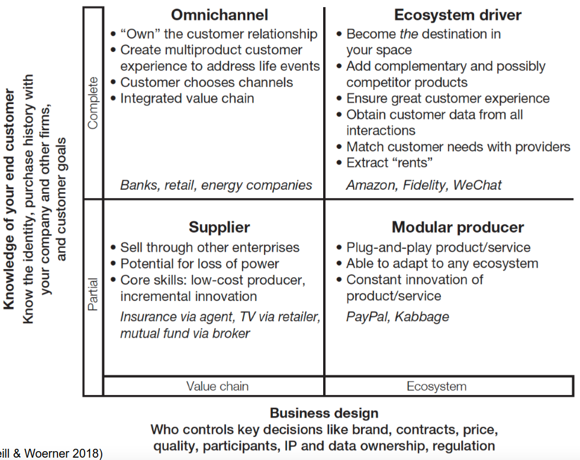

# Business Model for the Digital Economy - 3rd Class

> 25th September 2023 -- FEUP --> Key Features of the Digital Economy

## Two Dimensions of Business Models (cont. from last class)

- From controlled value chains (à la Michael Porter circa 1980) to more- complex, networked systems.
  - to what extent they are part of a value chain that can be controlled (and that they believe they or someone must control),
  - or to what extent they are part of a more complex digital ecosystem, in which the dynamics are less about command and control and more about building maintaining, and using networks.
- From less familiarity with customer needs and life events to a better, closer understanding of them, resulting in better customer engagement.
  - how much they know about the needs of their end customers and how much they can know.

## Digital Business Models

- **Supplier**
  - producer that sells through other enterprises
- **Omnichannel**
  - integrated value chain that creates multiproduct, multichannel customer experiences to address real-life events
- **Modular Producer**
  - provider of plug-and-play products and services
- **Ecosystem Driver**
  - organizer of an ecosystem, a coordinated network of enterprises, devices, and customers to create value for all participants, which isthe destination in a particular domain (such as
shopping)

Many large companies operate in more than one model.

## Digital Business Model Framework

    

### Questions wrt Unbabel

#### Recap: Unbabel Business Model

| Block | Description |
| --- | --- |
| Value Proposition | <ul> <li>AI based translation <li> Broadening business reach to new markts <li> LangOps platform </ul> |
| Customer Segments | <ul> <li> International companies offering services in multiple languages </ul>
| Customer Relationships | <ul> <li> Summit, Webinars <li> Quality metrics <li> Play first move advantage <li> Support </ul>|
| Channels | <ul> <li> Website <li> Sales Team <li> CRM's (Customer Relationship Management) </ul> |
| Revenue Streams | <ul> <li> Subscription-based model <li> Pay per word </ul> |
| Cost Structure | <ul> <li> Salaries <li> Infrastructure <li> Marketing <li> R&D </ul> |
| Key Activities | <ul> <li> Problem Solving <li> Platform Development </li> |
| Key Resources | <ul> <li> AI and <li> Data <li> Editor Community </ul> |
| Key Partners | <ul> <li> Human <li> Translators (Editors) <li> Conversational AI </ul> |

#### Which quadrant does the company best fit in?

> Unbabel fits best in the **Modular Producer** quadrant. They offer a somewhat of a "Plug-and-play" product to the costumers.

#### How are they using digital technologies?

> Online marketing, online sales, AI technology in their core product

#### How can they move up and right?

> Do more with the customer data they have, and use it to improve their product and customer experience.
>  
> Increase the number of customers, and the number of languages they support.
>  
> Transform unstrctured customer intercation data into business models/workflow drivers.

## Digital Economy

- **Information Goods** --> Anything that can be digitized. 
  - E.g.: Music, Movies, Books, Software, ...

### Digital Vs Physical

    <table border="0">
        <tr>
            <th colspan="5" /> 
        </tr>
        <tr>
            <td> Examples </td>
            <td> Stages </td>
            <td colspan="2"> Characteristics </td>
            <td> Implications </td>
        </tr> 
        <tr>
            <td> Games </td>
            <td rowspan="2"> Production </td>
            <td rowspan="4"> <ul> <li> Produce Once Sell Forever <li> Lower limit consumption <li> Customize more & more cheaply <li> Layered deployments
            <td rowspan="4"> <ul> <li> High fixed costs <li> Very low marginal costs <li> Simple, cheap to replicate and distribute <li> Challenge is managing rights
            <td rowspan="4"> <ul> <li> Pricing on <b> value </b> <li> Maximize <b> value </b> by managing rights (Not protection)
        </tr>
        <tr>
            <td> Movies </td>
        </tr>
        <tr>
            <td> Books </td>
            <td rowspan="2"> Distribution </td>
        </tr>
        <tr>
            <td> News </td>
        </tr>
        <tr>
            <td> Music </td>
            <td rowspan="2"> Search </td>
            <td rowspan="4" > <ul> <li> Ubiquitous, fast, simple, cheap <li> Acessible, not as good experience as analog (books), easier to standardize
            <td rowspan="4"> <ul> <li> Attention management <li> Experience Goods
            <td rowspan="4"> <ul> <li> Directing customers to <b> value </b> <li> Support e<b>valu</b>ation
        </tr>
        <tr>
            <td> Software </td>
        </tr>
        <tr>
            <td> Database </td>
            <td rowspan="2"> Consumption </td>
            <td>
        </tr>
    </table>

### Differential Pricing - Price on Value

| Examples | Pricing Schme | Category
| --- | --- | --- |
| E-Commerce | Personalized discount based on purchase history | Personalized - Ideal differential pricing |
| Adobe | Students, Business, Private | Grouping - As a function of observable characteristics |
| Netflix | Basic, Standard, Premium | Versioning - Customers self-service |

#### Personalized Pricing

- Universities
- Need to know the demand
- Large B2B contracts - Easier to charge different prices

#### Grouping

- Spotify
  - Group by country, student, family, ...
- Characteristics observable and demand-correlated
- Stable charateristics, no reselling

#### Versioning

- Software
  - Three categories mechanism
- Different customers with different willingness to pay for different sets of features

### Rights Managements - How much free use maximizes value?

| Examples | Strategies | Categories |
| --- | --- | --- |
| Jetbrains | Free use as long as you are a student |  Complementary products |
| Online Games | Game is free, in-app purchases |  Complementary products  |
| Spotify | Free trial for premium | Give away part, sell the rest |
| Linux | Open source + Paid services |  Sell Complementary products + services |
| On-line publications | Limit on number of free articles |  Limit demand for repeated views |
| McAfree 1989 | Free with full functionality |  Give away similar but not identical product |
| Anti-virus | Free with limited functionality |  Pay whatever the user thinks it is worth |

### Attention Economics - How to facilitate getting to the most valuable good?

| Examples | Strategies | Categories |
| --- | --- | --- |
| Amazon | Related products | Non-customized recommender systems |
|   | Top-Sales | Non-customized recommender systems |
|   | Digital helper for selecting plans |  Personalized Content |
|   | Personalized recomendations/advertising | Personalized Content |

### Experience Goods - How to facilitate evaluation?

| Examples | Strategies | Categories |
| --- | --- | --- |
| Content Distribution Platforms | Trailers, look inside | Preview and browse |
| Spotify | Free trial for premium | Preview and browse |
| Amazon | Reviews from customers | Reviews |
| Specialized News | Influencial reviews | Reviews |
| Samsung | Branding and Reputation | What's associated with the business |
